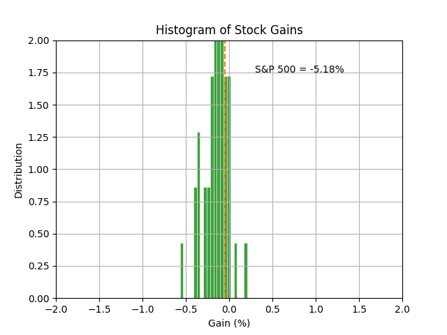

# Monkey Stock Guesser

```
           __,__
  .--.  .-"     "-.  .--.
 / .. \/  .-. .-.  \/ .. \\
| |  '|  /   Y   \  |'  | |
| \   \  \ 0 | 0 /  /   / |
 \ '- ,\.-"`` ``"-./, -' /
  `'-' /_   ^ ^   _\ '-'`
      |  \._   _./  |
      \   \ `~` /   /
       '._ '-=-' _.'
          '~---~'
```

Python simulation of a monkey that will throw a dart to determine which S&P500 stocks to buy. Will then draw the results on a matplotlib histogram and calculate an average loss/gain:


